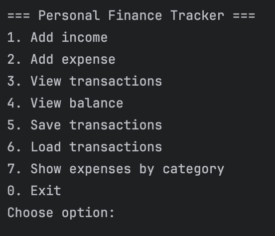
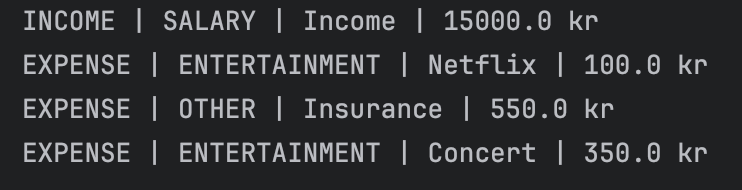
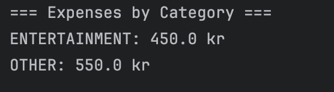

# Personal Finance Tracker

A Java-based personal finance management application developed as a personal portfolio project while studying Datamatiker at KEA.

## Overview

Personal Finance Tracker is a console-based application that allows users to manage income and expenses, categorise transactions, track balances, and save data between sessions.

The project was developed to strengthen my understanding of object-oriented programming, file handling, collections, and exception handling in Java.

---

## Features

### Transaction Management

* Add income transactions
* Add expense transactions
* Categorise transactions
* View all transactions

### Financial Overview

* View current balance
* View expenses grouped by category

### Data Persistence

* Save transactions to file
* Load transactions from file

### Input Validation

* Validation of numeric input
* Protection against invalid transaction amounts

---

## Technologies

* Java
* Object-Oriented Programming (OOP)
* Enums
* Collections (ArrayList)
* File I/O
* Exception Handling
* Git & GitHub
* IntelliJ IDEA

---

## Project Structure

```text
src
│
├── model
│   ├── Transaction.java
│   ├── TransactionType.java
│   └── Category.java
│
├── service
│   ├── BudgetManager.java
│   └── FileHandler.java
│
├── ui
│   └── Menu.java
│
└── Main.java
```

---

## Screenshots

### Main Menu



### Transactions Overview



### Balance Overview


### Expense Report



---

## What I Learned

Through this project I gained practical experience with:

* Object-Oriented Programming
* Working with collections
* File persistence
* Exception handling
* Input validation
* Structuring Java applications
* Version control using Git and GitHub

---

## Future Improvements

* Monthly financial reports
* Search transactions
* Delete transactions
* GUI version using JavaFX
* Database integration

---

## Author

Developed by Gustav Clement.
